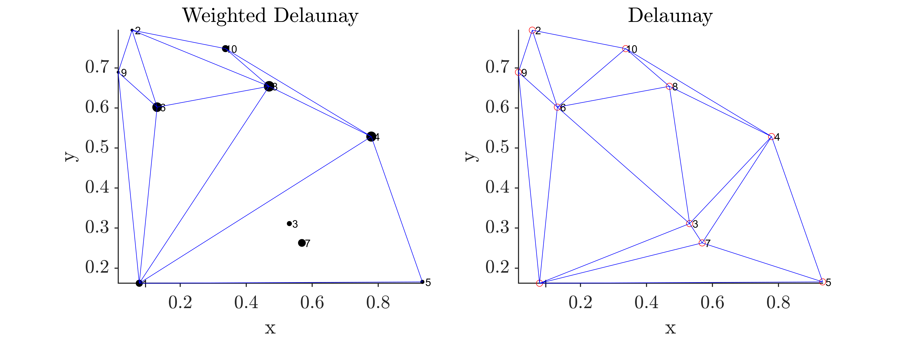

# Weighted Delaunay Triangulation
This repository contains MATLAB and python codes for computing weighted delaunay triangulation.

Weighted delaunay triangulation is computed by exploiting the duality between Delaunay triangulation and a convex hull of one dimension higher.

## In Python
An example and function to computed it is provided in `weighted_delaunay.ipynb`

## In MATLAB
The matlab function provided as `WeightedDelaunay.m` takes points in `num_points X dimensions` and weights as `num_points X 1` MATLAB arrays and produces triangulated faces compatible to be plotted with MATLAB `triplot.m`. Here's an example script for the same.

```matlab
num_points = 10;
points = rand(num_points,2);
weights = 10*rand(num_points,1);

[cells, lifted] = WeightedDelaunay(points,weights);

close all;
figure('units','normalized','position',[0.2,0.2,0.6,0.4])
subplot(121)
scatter(points(:,1),points(:,2),100*(weights./max(weights)),'k','filled');
hold on;
text(points(:,1),points(:,2),cellstr(num2str((1:num_points)')))
triplot(cells,points(:,1),points(:,2));
hold off;
fig_labels(2,'title','Weighted Delaunay')

DT = delaunay(points(:,1),points(:,2));
subplot(122)
plot(points(:,1),points(:,2),'ro');
hold on;
text(points(:,1),points(:,2),cellstr(num2str((1:num_points)')))
triplot(DT,points(:,1),points(:,2));
hold off;
fig_labels(2,'title','Delaunay')
```

This produces the following figure as an output.



